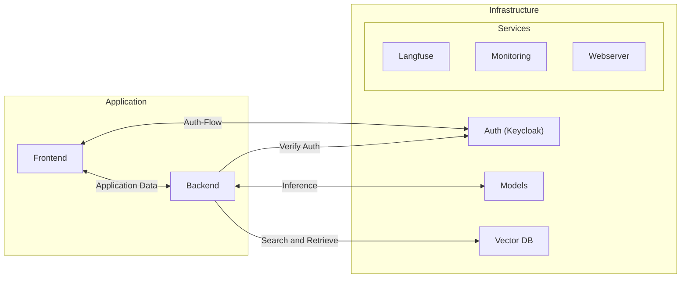

# IAI Chatbot

This work is the Backbone for the quantitative comparison of the impact chatbot architectures have on the domain-specific knowledge of a LLM. The architectures can be found at: https://github.com/DavidExler/Chemical-Chatbot-Architectures

## Get Started

### Overview



### Packages

- **Application**
  - [backend](./backend): Backend Application
  - [frontend](./frontend): Frontend Application
- **Infrastructure**
  - [vector-db](./vector-db): Vector Database for Embeddings
  - [keycloak](./keycloak): Keycloak Authentication Server used for Authentication in Frontend and other Services
  - [models](./models): Model Servers for hosting LLM Models
  - **Additional Services**
    - [langfuse](./langfuse): LLM Telemetry Data & Feedback Collection
    - [monitoring](./monitoring): Monitoring with Prometheus, Grafana, Watchtower and Autoheal
    - [webserver](./webserver): Nginx Reverse Proxy for all Services

### Docker Compose

All our Services are dockerized and can be started with `docker compose`.

So simply change directory to a subfolder and run `docker compose up -d`.

For example to start the backend:
```bash
cd backend
docker compose up -d
```

Read more about docker and docker compose [here](https://docs.docker.com/get-started/).

### Makefile

Additionally, we provide a `Makefile` to simplify the usage of `docker compose`.

To start all services, simply run:
```bash
make up
```

You can also specify the services you want to start:
```bash
make up backend frontend
```

To stop all services, simply run:
```bash
make down
```

Read more about makefiles [here](https://www.gnu.org/software/make/manual/make.html).

### Configuration

All services are configured via `.env` files. You can find an example `.env` file in each service folder.

To start a service, you need to copy the `.env.example` to `.env` and adjust the configuration.


## Citation

This work is part of the following paper:

> **A comparison of different approaches to increase a Large Language Model’s chemical capabilities**  
> *Authors: D Exler, M Raimann, M Münker, M Rosin, J E Urrutia
Gómez, M Reischl1, C. Niemeyer and L Rettenberger*  
> *...*


## License

...